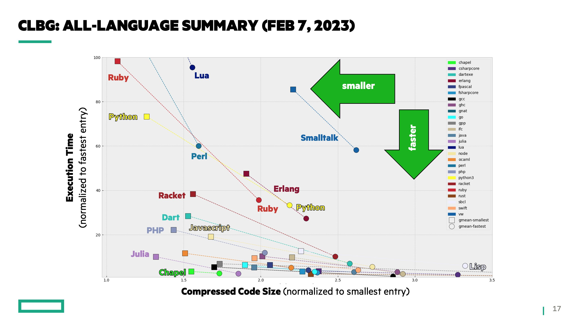

# Why Julia - a Manifesto.

The purpose of this repository is to be an accessible and well-formulated summary of the reasons academia should be using the [Julia programming language](https://julialang.org) for scientific computing / computational sciences / data analysis / research software engineering.
Feel free to share it with interested parties that ask "Why Julia?".

_(clearly, this post is expressing the views of the contributors of this GitHub repository; nevertheless, these views are based on factual information provided explicitly in the later sections)_

1. [What's a programming language?](#whats-a-programming-language)
2. [What's most important in a programming language?](#whats-most-important-in-a-programming-language)
3. [Julia is the best language (for science)](#julia-is-the-best-language-for-science)
   1. [Speed of writing](#speed-of-writing)
   2. [Speed of execution](#speed-of-execution)
   3. [Available libraries](#available-libraries)
   4. [Extensibility/Composability](#extensibilitycomposability)
   5. [Accessibility/Shareability/Reproducibility](#accessibilityshareabilityreproducibility)
4. [Detailed advantages of Julia](#detailed-advantages-of-julia)
5. [But why do you try so hard to convince people?](#but-why-do-you-try-so-hard-to-convince-people)

## What's a programming language?

A programming language is a tool for the scientist to get their job done, while allowing their work to be further re-used and extended upon by other scientists.

## What's most important in a programming language?

Keeping it simple and with academia in mind, the most fundamentally important aspects of a programming language are:

1. **Speed of writing.** How quick it is for the scientist to get their ideas from a piece of paper/their brain into a runnable prototype on a computer.
2. **Speed of execution.** How quick the written code is run by the computer.
3. **Available libraries.** How many good packages/extensions are there that provide relevant functionality out-of-the-box, and whether they are well documented as well.
4. **Extensibility/Composability.** How easy it is to re-use, or extend, or compose with, an existing library, even in a different programming language.
5. **Accessibility/Shareability/Reproducibility.** How easy it is to get started with the language (installations and learning the first steps), and how easy it is to share the work with other scientists so that they effortlessly reproduce the shared work.

Now we may ask ourselves: _"What is the ideal programming language?"_

It is the one that is the best in all of the aforementioned fundamental aspects. This language does not exist as pros-and-cons are an integral part of the real world. Therefore, the best _real_ language is the one that overall accumulates the highest quality when explored across these four fundamental aspects.

## Julia is the best language (for science)

When compared over these fundamental aspects, **Julia emerges as the clear overall winner**. More details and references are given in the next section. The summary is:

### Speed of writing

Julia is a dynamic language allowing interactive and flexible code creation and exploration. The syntax of Julia is as close as possible to math, and also modern (high level). It also includes innovative progress such as automatically understanding when statements end or allowing usage of Unicode. These advances make it so that often the Julia code is a 1-to-1 mapping to the scientific paper it was implemented from. Julia also does not require explicitly type-annotating anything (although it is possible to do so), further increasing the efficiency of writing code.

Multiple dispatch is a programming paradigm that is most similar to scientific thought, because it detaches processes from data types. This accelerates the process of getting the scientific ideas into runnable code.

### Speed of execution

Julia compiles to machine code that is routinely as fast as C/FORTRAN due to its intelligent type inference system. That is, standard user Julia code gets compiled to efficient machine code - no need to arbitrary language extensions (e.g., Numba, Cython, ...). Julia has native support for parallel and distributed computing. These aspects are also easy to use. Julia has strong GPU support via packages which are also easy to use. The Julia package ecosystem has even more packages for code performance acceleration such as [Transducers.jl](https://github.com/JuliaFolds/Transducers.jl), [ThreadsX.jl](https://github.com/tkf/ThreadsX.jl), [FLoops.jl](https://github.com/JuliaFolds/FLoops.jl), [MultiThreadedCaches.jl](https://github.com/JuliaConcurrent/MultiThreadedCaches.jl), [ParallelAccelerator.jl](https://github.com/IntelLabs/ParallelAccelerator.jl), [Dagger.jl](https://github.com/JuliaParallel/Dagger.jl), and more.

### Available libraries

Julia has software organizations for seemingly every scientific area. From high energy physics to economics, it is likely that there is a _developer_ (not just user) community around the field you work on already, with native Julia software that match up to alternatives in other languages. Moreover, these organizations already contain some of the best-in-class software, that is, the most featureful, most performant, and most accessible tool for a particular task. Examples are [DifferentialEquations.jl](https://github.com/SciML/DifferentialEquations.jl), [DynamicalSystems.jl](https://github.com/JuliaDynamics/DynamicalSystems.jl), [Turing.jl](https://github.com/TuringLang/Turing.jl), [NeuralPDEs.jl](https://github.com/SciML/NeuralPDE.jl), [Distributions.jl](https://github.com/JuliaStats/Distributions.jl), [Makie.jl](https://github.com/MakieOrg/Makie.jl), [JuMP.jl](https://github.com/jump-dev/JuMP.jl), and many more. Besides, even if there is some tool that you need that is not available in Julia, that is not a problem due to its composability with other languages (see below).

_We should point out how surprising this is. Julia is a more recent programming language, has much less users, and has received much less large scale funding, when compared to Python, the currently most popular programming language for scientist. The fact that Julia matches Python's library ecosystem, and in many fields it surpasses it, is a testament to 1) how easy it is to develop, or contribute to, software in Julia, and 2) the amount of software engineering talent that Julia has attracted._

### Extensibility/Composability

This aspect, while often ignored in programming language discussions, is crucial in academia. It can make the difference of a scientific work being a cryptic script forgotten in a hard drive for the rest of time, or instead being a full package (or part of another already established package) that other scientists can then re-use and continue from to accelerate their own research. Additionally, good extensibility and composability typically also means code re-use, which itself means good maintainability (that it is easy to maintain your codebase in the long term).

Thankfully, Julia is objectively the best tool for extensibility and composability in scientific code. When it comes to composability with software from other languages, Julia allows _natively_ calling C/FORTRAN code. Packages such as [PythonCall.jl](https://github.com/cjdoris/PythonCall.jl) or [RCall.jl](https://github.com/JuliaInterop/RCall.jl) allows directly calling code from the respective languages (in fact, PythonCall.jl allows the typical object oriented syntax to be used in Julia).

But the real strength of Julia lies within the composability and extensibility that Julia packages have with each other. Julia has brought in an unprecedented amount of code re-use, enabling packages to easily communicate with each other and extend each other, all without the boilerplate code and name spaces issues one encounters in languages like Python. This is part of the reason that Julia has seen such an explosive growth of available packages in practically every scientific field.

(proof of claims: https://www.youtube.com/watch?v=kc9HwsxE1OY)

### Accessibility/Shareability/Reproducibility

Getting started in Julia is simple!
Installing the core language is a simple download-and-click-install for every operating system. Julia features a version multiplexer called [`juliaup`](https://github.com/JuliaLang/juliaup), that makes managing multiple Julia versions a trivial one-liner.
Installing packages for the language is equally simple.
Julia features an exceptionally strong [package manager](https://github.com/JuliaLang/Pkg.jl) (which is itself a package of the language). Since most packages of Julia are written in pure Julia, installing them is also a simple one line command. When it comes to binary dependencies, Julia has a pioneering pre-built binary system: binaries are built, compiled, and stored, for any system and platform combinations, and are automatically installed with a package that has binary dependencies. No more spending weeks to just install your software!

Sharing Julia projects is equally simple due to the strong package manager. A Julia environment (which are two text files) carries a list of of all the packages used, and their dependencies, all the way down to the exact git-commit of the used package. One can share this environment and the associated scripts and the receiving user can instantiate them, reproducing the same environment. This runs the same code with the same versions hence yielding the same output.

## Detailed advantages of Julia

This section goes through specific advantages of Julia in a bullet-point list. It also gives references and provides further reading resources.

1. **It solves the two language problem**: it is a dynamic and interactive language that allows real time scientific exploration typically done in interpreted languages like Python, but still offers the performance of static low level languages such as C. Julia works by compiling machine level code and hence all basic programming concepts such as iteration, broadcasting, function-as-arguments, are fast by themselves. Hence, you would never have to "re-write" a code in Julia in another language to make it faster! This way you spent less time writing (or re-writing code) and more time progressing your work. It also means that you don't have to be proficient in two programming languages to get involved with a library development.
2. **It occupies the "sweet spot" of high performance and simple code** in a global comparison between all programming languages: 

   This figure is created by developers of the [Chapel Language](https://chapel-lang.org/), which does not particularly target academic usage. The image comes courtesy of a public post: https://twitter.com/ChapelLanguage/status/1623389242822111232 .
3. **Its syntax is intuitive and as close to math as possible**: The combination of high level syntax, Unicode, and simple to reason for code makes the code faster to write and read. Additionally, the modern Julia syntax parser eliminates the use of many "decorators" such as ending lines with `;` or requiring indentation to denote code blocks, as it understands automatically when commands start and end.
4. **Multiple dispatch**: is the core programming paradigm of Julia and is used with functional programming. In our opinion is the [most suitable paradigm to implement scientific thought in code](https://www.youtube.com/watch?v=7y-ahkUsIrY) because it parallelizes scientific thinking: a "process" (function) does not belong to any particular data structure. Multiple dispatch and the exponential expressive power it brings are showcased well in [this talk by Stefan Karpinski](https://www.youtube.com/watch?v=kc9HwsxE1OY).
5. **Unprecedented code re-use and inter-package communication**. This is a direct consequence of multiple dispatch and it is a unique property of Julia that has not been seen in other programming languages. In short, in Julia packages can use and extend other packages very easily (most of the times for free!), without boiler-plate or glue code. Due to this, most packages re-use existing code and have common interfaces with other packages. For example [in this talk Chris Rackauckas](https://youtu.be/tynmTkpdAME?si=44MRCVQtW4sQ5JFI&t=1879) highlights how in Julia developing for machine learning is the same as developing as for any other standard situation, which is a big reason why the scientific machine learning open community in Julia is matches up to Python equivalents like PyTorch and well exceeds them when it comes to differential equations side. To bring the point home even further, see [this presentation by Kristoffer Carlsson and Fredrik Bagge Carlson](https://youtu.be/2MBD10lqWp8?si=cst_gfNXyWs0hH7z&t=624) for an insane showcase of the power of the multiple dispatch system, showing how a user gets **for free** trigonometric functions for real numbers, matrices, error propagation, symbolic dynamics, and automatic differentiation, all with the base `sin` function and only 10 lines of code, and all while solving a differential equation that includes all these possible types in the `sin` function.
6. **Julia is written in Julia**: ([from a practical academic's point of view](https://discourse.julialang.org/t/how-is-julia-written-in-julia/50918/8?u=datseris)) this is why Julia solves the two language problem, and it comes with even more advantages.
   * A typical user code isn't really different from Julia's very own base code, all the way down to basic arithmetic. This means, that understanding source code of other's packages, or even Julia's code itself, is straightforward. Hence, it is also straightforward to improve an existing codebase via a code contribution.
   * The above leads to the natural consequence that a typical Julia user is already 90% of the way to being a Julia package developer. Julia's strong package tooling suite further makes this easier, which explains the explosive growth of Julia despite the lack of funding (versus e.g., Python).
   * Most basic Julia types are used almost everywhere, and even if they aren't, due to multiple dispatch a front-end user wouldn't care. To give an example: a Python user would _have_ to use e.g., array types from PyTorch to implement performant advanced algorithms, especially for large datasets. However, if performant version of a function/operation a user needed, like e.g., the gamma function or some algorithm that operates on arrays, was not implemented for this "special" array type, that user is doomed. They will most likely not understand how a package like PyTorch implements numerics, to add their version of what they need. Instead, they will have to convert to "normal" python array, at a price of a slowdown in performance, and then going back again to the "fast" array versions. In Julia such things don't happen, because the "fast" array version is the "standard" array version, and even if not, all array types are anyways part of the same abstract interface due to multiple dispatch.
   * As a consequence, Python users are "forced" to find existing implementations of algorithms/functionalities in these Python packages like PyTorch/Numpy, and are "discouraged" from writing their own versions (writing a Runge-Kutta solver in Python was one of the biggest mistakes I've made!). Julia users instead could write their own low-level code, which improves their algorithmic/programming skills, gives them better understanding of how the algorithm works, and gives them more flexibility over it as well.
7. **Julia's package ecosystem is already top-of-the-class in some scientific disciplines**. Even though Julia is very new, and with a relatively small user base ([StackOverflow results](https://survey.stackoverflow.co/2022/#technology-most-popular-technologies) show Python usage at about 50%, Julia at about 2%), in many disciplines Julia's ecosystem is at least as good as Python's, while in some others it is even better. I can only speak from experience, and from my perspective these ecosystems are about [nonlinear dynamics & complex systems](https://juliadynamics.github.io/JuliaDynamics/), [differential equations & scientific machine learning](https://sciml.ai/), [machine learning and auto differentiation](https://fluxml.ai/), [statistics](https://github.com/JuliaStats) (especially Distributions.jl and OnlineStats.jl), [interactive plotting](https://docs.makie.org/stable/) and even a [scientific project assistant software](https://github.com/JuliaDynamics/DrWatson.jl).
8. **Interoperability with other languages**: C is directly and natively callable from Julia. Python is callable from Julia with the same syntax as normal object-oriented Python code via [PythonCall.jl](https://github.com/cjdoris/PythonCall.jl). This means that you can **really use any Python package in Julia**, most of the time without even changing the syntax of the Python code. R, FORTRAN, etc., are callable similarly simply.
9.  **Exceptionally strong integrated package manager**: Julia's package manager is just another package. It is flexible, strong, leading to less ambiguities versus other languages. On top of it, a strong binary shipping system is built. This all means that everything runs everywhere: no `makefile` nonsense, no spending weeks figuring out how to install things, no worries whether your program will be able to run on Windows. Everything is a 1-click install.
10. **Welcoming and responsive community**: My experience using Julia for 6+ years is that it has one of the most welcoming and responsive communities I have encountered. New questions asked on the official Julia Discourse forum or Slack channels consistently get answers within minutes. This means that there is no real reason to worry that your questions won't get answers due to the relatively smaller community of Julia versus e.g., Python.
11. **Many large-scale projects and organizations have already adopted Julia**: For example, the USA federal government uses Julia for its cost-benefit analysis of climate change (https://www.mimiframework.org/). A blend of MIT, CalTech, and JPL scientists use Julia to create a brand new Earth System Model (https://clima.caltech.edu/). NASA switched from MATLAB to Julia for its Launch Service simulations, resulting in a 15,000x performance acceleration and and an overall more flexible code base that is also easier to learn (https://www.youtube.com/watch?v=tQpqsmwlfY0).
12. **Easy installs and pre-built binary dependencies**: In Julia the days where you would have to spend weeks, while being supervised by the senior postdoc of the group, _just to install a software_ are long gone. Since most Julia packages are written in Julia, installing anything is a trivial 1 line of code. But even in cases of binary dependencies, Julia has made things rather easy! It offers persistent binary artifact storage via Yggdrasil by building binary system images for any platform combinations: [BinaryBuilder.jl](https://docs.binarybuilder.org/stable/) (and see the [official blog post](https://julialang.org/blog/2019/11/artifacts/) for more details).

## But why do you try so hard to convince people?

This repository is not funded by Julia-related companies or funded by anything for that matter! We try to convince people because **we genuinely believe that Julia can accelerate scientific progress and increase openness in code in academia**. It's a better future for everyone :)

_(Full disclosure: authors of this post also develop packages for the Julia programming language. More Julia users means more potential users for these packages, which means more potential contributors for these packages. However, the potential increase in contributors is such a low probability event for a given "conversion" to Julia, that it cannot form a basis for trying to convince people in the first place.)_
